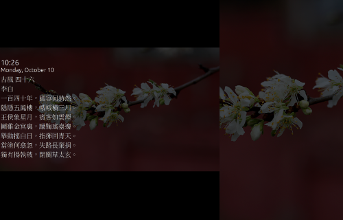

# cinnamon-screensaver-poem

Display a random poem at cinnamon locked screen.

## Requirements

This project use `mongoDB` to sample a random poem. However, this function can be simply replaced by python `json` and `random` module.

## Locate screensaver module in the system

Execute the following command on `Linux Mint 19.3` results in 

```
>>> cat $(which cinnamon-screensaver-command)
#!/bin/sh

exec /usr/share/cinnamon-screensaver/cinnamon-screensaver-command.py "$@"
```

The screensaver module directory is `/usr/share/cinnamon-screensaver` in my case.

## Find prefered poem database

Look into github topics:

- [Chinese poetry](https://github.com/topics/chinese-poetry)
- [Arabic poetry](https://github.com/topics/arabic-poetry)

For poems written in English:
- [A Gutenberg Poetry Corpus](https://github.com/aparrish/gutenberg-poetry-corpus)


## Load poetry database to MongoDB(optional)

The downloaded poetry datasets are presented in `json` or something similar. Import the databse to MongoDB with `mongoimport`. Check [mongoimport document](https://www.mongodb.com/docs/database-tools/mongoimport/) for more information.

```
mongoimport --db poetry --collection chinese --file poetry.json
```

__Important__: if you don't wish to use MongoDB, try to change `mongo=False` in `msg_generator.py` to use `json` and `random` module. 

## Poetry sampler

Copy `msg_generator.py` and `clock.py` to `/usr/share/cinnamon-screensaver`.

## Result


